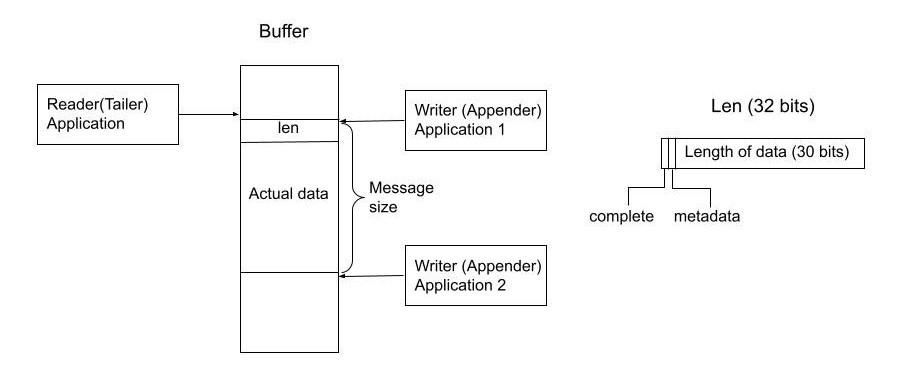

= Chronicle Wire
Chronicle Software
:css-signature: demo
:toc: macro
:toclevels: 2
:icons: font

image:https://maven-badges.herokuapp.com/maven-central/net.openhft/chronicle-wire/badge.svg[caption="",link=https://maven-badges.herokuapp.com/maven-central/net.openhft/chronicle-wire]
image:https://javadoc.io/badge2/net.openhft/chronicle-wire/javadoc.svg[link="https://www.javadoc.io/doc/net.openhft/chronicle-wire/latest/index.html"]
//image:https://javadoc-badge.appspot.com/net.openhft/chronicle-wire.svg?label=javadoc[JavaDoc, link=https://www.javadoc.io/doc/net.openhft/chronicle-wire]
image:https://img.shields.io/github/license/OpenHFT/Chronicle-Wire[GitHub]
image:https://img.shields.io/badge/release%20notes-subscribe-brightgreen[link="https://chronicle.software/release-notes/"]
image:https://sonarcloud.io/api/project_badges/measure?project=OpenHFT_Chronicle-Wire&metric=alert_status[link="https://sonarcloud.io/dashboard?id=OpenHFT_Chronicle-Wire"]

toc::[]

== About

Chronicle Wire is a Wire Format abstraction library, The purpose of Chronicle Wire is to address the following concerns in a consistent manner:

- Application configuration. (Using YAML)
- Data serialization (YAML, binary YAML, JSON, Raw binary data, CSV)
- Accessing off-heap memory in a thread-safe manner. (Bind to shared off-heap memory)
- High performance data exchange using binary formats. Only include as much meta data as you need.

== Design

Chronicle Wire uses Chronicle Bytes for bytes manipulation, and Chronicle Core for low level JVM access.

=== Why are these concerns conflated?

Often you want to use these interchangeably.

- Configuration includes aliased type information.
This supports easy extension by adding new classes/versions, and cross-platform using type aliasing.
- By supporting types, a configuration file can bootstrap itself.
You control how the configuration file is decoded.
See https://github.com/ChronicleEnterprise/Chronicle-Datagrid/blob/ea/src/test/resources/datagrid.yaml[`datagrid.yaml`].
- To send the configuration of a server to a client, or from a client to a server.
- To store the configuration of a data store in its header.
- In configuration, to be able to create any object or component.
- Save a configuration after you have changed it.
- To be able to share data in memory between processes in a thread-safe manner.

=== Features

Chronicle Wire supports a separation of describing what data you want to store and retrieve, and how it should be rendered/parsed.
Chronicle Wire handles a variety of formatting options, for a wide range of formats.

A key aim of Chronicle Wire is to support schema changes.
It should make reasonable attempts to handle:

* optional fields
* fields in a different order
* fields that the consumer doesn't expect; optionally parsing them, or ignoring them
* more or less data than expected; in field-less formats
* reading a different type to the one written
* updating fixed-length fields, automatically where possible using a `bound` data structure.
* dynamic updates of Enums or objects passed-by-name

Chronicle Wire will also be efficient where any, or all, of the following points are true:

* fields are in the order expected
* fields are the type expected
* fields names/numbers are not used
* self-describing types are not needed
* random access of data values is supported.

Chronicle Wire is designed to make it easy to convert from one wire format to another.
For example, you can use fixed-width binary data in memory for performance, and variable-width or text over the network.
Different TCP connections could use different formats.

Chronicle Wire also supports hybrid wire formats.
For example, you can have one format embedded in another.

== Support

This library requires Java 8. Support for `C++` and `C#` is planned.

== Text Formats

The text formats include:

* `YAML` - subset of mapping structures included
* `JSON` - superset to support serialization
* `CSV` - superset to support serialization
* `XML` - planned

Options include:

* field names (for example, JSON), or field numbers (for example, FIX)
* optional fields with default values that can be dropped
* zero-copy access to fields - planned
* thread-safe operations in text - planned

To support wire format discovery, the first byte should be in the `ASCII` range; adding an `ASCII` whitespace if needed.

== Binary Formats

The binary formats include:

* binary YAML.
* delta compressing Binary YAML.This is a Chronicle Wire Enterprise feature
* typed data without fields
* raw untyped fieldless data
* Trivially Copyable Objects (lowest latency)

Options for Binary format:

* field names or field numbers
* variable width
* optional fields with a default value can be dropped
* fixed width data with zero copy support
* thread-safe operations

Note: Chronicle Wire supports debug/transparent combinations like self-describing data with zero copy support.

To support wire format discovery, the first bytes should have the top bit set.

== Using Wire

=== link:https://github.com/OpenHFT/Chronicle-Wire/blob/ea/demo/src/main/java/run/chronicle/wire/demo/Example1.java[Simple use case]

First you need to have a buffer to write to.
This can be a `byte[]`, a `ByteBuffer`, off-heap memory, or even an address and length that you have obtained from some other library.

[source,Java]
----
// Bytes which wraps a byte[]
Bytes<byte[]> bytes = Bytes.allocateElasticOnHeap();
// or
// Bytes which wraps a ByteBuffer which is resized as needed.
Bytes<ByteBuffer> bytes = Bytes.elasticByteBuffer();
----

Now you can choose which format you are using.
As the wire formats are themselves unbuffered, you can use them with the same buffer, but in general using one wire format is easier.

[source,Java]
----
Wire wire = new TextWire(bytes);
// or
WireType wireType = WireType.TEXT;
Wire wireB = wireType.apply(bytes);
// or
Bytes bytes2 = Bytes.allocateElasticOnHeap();
Wire wire2 = new BinaryWire(bytes2);
// or
Bytes bytes3 = Bytes.allocateElasticOnHeap();
Wire wire3 = new RawWire(bytes3);
----

So now you can write to the wire with a simple document.

[source,Java]
----
wire.write("message").text("Hello World")
      .write("number").int64(1234567890L)
      .write("code").asEnum(TimeUnit.SECONDS)
      .write("price").float64(10.50);

System.out.println(bytes);
----

prints

[source,yaml]
----
message: Hello World
number: 1234567890
code: SECONDS
price: 10.5
----

[source,Java]
----
// The same code for BinaryWire
wire2.write("message").text("Hello World")
        .write("number").int64(1234567890L)
        .write("code").asEnum(TimeUnit.SECONDS)
        .write("price").float64(10.50);

System.out.println(bytes2.toHexString());
----

prints

[source,text]
----
00000000 c7 6d 65 73 73 61 67 65  eb 48 65 6c 6c 6f 20 57 ·message ·Hello W
00000010 6f 72 6c 64 c6 6e 75 6d  62 65 72 a6 d2 02 96 49 orld·num ber····I
00000020 c4 63 6f 64 65 e7 53 45  43 4f 4e 44 53 c5 70 72 ·code·SE CONDS·pr
00000030 69 63 65 90 00 00 28 41                          ice···(A
----

Using `RawWire` strips away all the meta data to reduce the size of the message, and improves speed.
The down-side is that we cannot easily see what the message contains.

[source, Java]
----
// The same code for RawWire
wire3.write("message").text("Hello World")
        .write("number").int64(1234567890L)
        .write("code").asEnum(TimeUnit.SECONDS)
        .write("price").float64(10.50);

System.out.println(bytes3.toHexString());
----

prints in `RawWire`.

[source, text]
----
00000000 0b 48 65 6c 6c 6f 20 57  6f 72 6c 64 d2 02 96 49 ·Hello W orld···I
00000010 00 00 00 00 07 53 45 43  4f 4e 44 53 00 00 00 00 ·····SEC ONDS····
00000020 00 00 25 40                                      ··%@
----

//For more examples see https://github.com/OpenHFT/Chronicle-Wire/blob/master/README-Chapter1.md[Examples Chapter1]
=== link:https://github.com/OpenHFT/Chronicle-Wire/blob/ea/demo/src/main/java/run/chronicle/wire/demo/Example2.java[Simple example with a data type]

This example is much the same as the previous section, with the code required wrapped in a method. See Section "The code for the class Data" for the code for Data.
[source,Java]
----
// Bytes which wraps a ByteBuffer which is resized as needed.
Bytes<ByteBuffer> bytes = Bytes.elasticByteBuffer();

Wire wire = new TextWire(bytes);

Data data = new Data("Hello World", 1234567890L, TimeUnit.NANOSECONDS, 10.50);
data.writeMarshallable(wire);
System.out.println(bytes);

Data data2= new Data();
data2.readMarshallable(wire);
System.out.println(data2);
----

prints

[source,yaml]
----
message: Hello World
number: 1234567890
code: NANOSECONDS
price: 10.5
----

[source,text]
----
Data{message='Hello World', number=1234567890, timeUnit=NANOSECONDS, price=10.5}
----

To write in binary instead

[source,Java]
----
Bytes<ByteBuffer> bytes2 = Bytes.elasticByteBuffer();
Wire wire2 = new BinaryWire(bytes2);

data.writeMarshallable(wire2);
System.out.println(bytes2.toHexString());

Data data3= new Data();
data3.readMarshallable(wire2);
System.out.println(data3);
----

prints

[source,text]
----
00000000 c7 6d 65 73 73 61 67 65  eb 48 65 6c 6c 6f 20 57 ·message ·Hello W
00000010 6f 72 6c 64 c6 6e 75 6d  62 65 72 a6 d2 02 96 49 orld·num ber····I
00000020 c8 74 69 6d 65 55 6e 69  74 eb 4e 41 4e 4f 53 45 ·timeUni t·NANOSE
00000030 43 4f 4e 44 53 c5 70 72  69 63 65 90 00 00 28 41 CONDS·pr ice···(A

Data{message='Hello World', number=1234567890, timeUnit=NANOSECONDS, price=10.5}
----

=== link:https://github.com/OpenHFT/Chronicle-Wire/blob/ea/demo/src/main/java/run/chronicle/wire/demo/Example3.java[Simple example with a nested data type]

In this example the data is marshalled as a nested data structure.

[source,java]
----

// Bytes which wraps a byte[] which is resized as needed
Bytes bytes = Bytes.allocateElasticOnHeap();

Wire wire = new TextWire(bytes);

Data data = new Data("Hello World", 1234567890L, TimeUnit.NANOSECONDS, 10.50);
wire.write("mydata").marshallable(data);
System.out.println(bytes);

Data data2= new Data();
wire.read("mydata").marshallable(data2);
System.out.println(data2);
----

prints

[source, yaml]
----
mydata: {
  message: Hello World,
  number: 1234567890,
  timeUnit: NANOSECONDS,
  price: 10.5
}
----

[source,text]
----
Data{message='Hello World', number=1234567890, timeUnit=NANOSECONDS, price=10.5}
----

To write in binary instead

[source,java]
----
Bytes bytes2 = new HexDumpBytes();
Wire wire2 = new BinaryWire(bytes2);

wire2.write("mydata").marshallable(data);
System.out.println(bytes2.toHexString());

Data data3= new Data();
wire2.read("mydata").marshallable(data3);
System.out.println(data3);
----

prints

[source,text]
----
c6 6d 79 64 61 74 61                            # mydata
80 40                                           # Data
c7 6d 65 73 73 61 67 65                         # message
eb 48 65 6c 6c 6f 20 57 6f 72 6c 64             # Hello World
c6 6e 75 6d 62 65 72                            # number
a6 d2 02 96 49                                  # 1234567890
c8 74 69 6d 65 55 6e 69 74                      # timeUnit
eb 4e 41 4e 4f 53 45 43 4f 4e 44 53             # NANOSECONDS
c5 70 72 69 63 65 90 00 00 28 41                # price

Data{message='Hello World', number=1234567890, timeUnit=NANOSECONDS, price=10.5}
----

=== link:https://github.com/OpenHFT/Chronicle-Wire/blob/ea/demo/src/main/java/run/chronicle/wire/demo/Example4.java[Simple example with a data type with a type]

In this example, the type is encoded with the data.
Instead of showing the entire package name which will almost certainly not work on any other platform, an alias for the type is used.
It also means the message is shorter and faster.

[source,Java]
----
Wire wire = new TextWire(Bytes.allocateElasticOnHeap());

ClassAliasPool.CLASS_ALIASES.addAlias(Data.class);

Data data = new Data("Hello World", 1234567890L, TimeUnit.NANOSECONDS, 10.50);
wire.write("mydata").object(data);
System.out.println(wire);

Data data2= wire.read("mydata").object(Data.class);
System.out.println(data2);
----

prints

[source,yaml]
----
mydata: !Data {
  message: Hello World,
  number: 1234567890,
  timeUnit: NANOSECONDS,
  price: 10.5
}
----

[source,text]
----
Data{message='Hello World', number=1234567890, timeUnit=NANOSECONDS, price=10.5}
----

To write in binary instead

[source,Java]
----
Wire wire2 = new TextWire(Bytes.allocateElasticOnHeap());

wire2.write("mydata").object(data);
System.out.println(wire2.bytes().toHexString());

Data data3 = wire2.read("mydata").object(Data.class);
System.out.println(data3);
----

prints

[source,text]
----
c6 6d 79 64 61 74 61                            # mydata
b6 04 44 61 74 61                               # Data
80 40                                           # Data
c7 6d 65 73 73 61 67 65                         # message
eb 48 65 6c 6c 6f 20 57 6f 72 6c 64             # Hello World
c6 6e 75 6d 62 65 72                            # number
a6 d2 02 96 49                                  # 1234567890
c8 74 69 6d 65 55 6e 69 74                      # timeUnit
eb 4e 41 4e 4f 53 45 43 4f 4e 44 53             # NANOSECONDS
c5 70 72 69 63 65 90 00 00 28 41                # price

Data{message='Hello World', number=1234567890, timeUnit=NANOSECONDS, price=10.5}
----

=== link:https://github.com/OpenHFT/Chronicle-Wire/blob/ea/demo/src/main/java/run/chronicle/wire/demo/Example5.java[Write a message with a thread-safe size prefix]

The benefits of using this approach are that:

* The reader (tailer) is blocked until the message is completely written.
* If you have concurrent writers (appenders):
** If the message size is not known, other writers will be blocked until the message is written completely.
** If the message size is known, other writers will leave buffer space for this writer to complete writing the message and concurrently write beyond the known size.

Figure 1 indicates the mechanism of thread-safe message writing.There is a 32-bit field called "len" in the
start of the message that an appender writes to buffer.The "len" field includes:

1. "complete" flag that shows whether the appender has completed writing this message or not.
2. "metadata" flag that shows whether this data is metadata.
3. the actual size of data in the remaining 30 bits of the "len" field.

After completing writing the message, the appender returns to the "len" field and sets the "complete" flag to one so that it indicates the message was written
completely.Afterwards, the reader starts reading the message.If the message size is not known, appender 2 also
stops writing until the message is written completely.If the size of the message is known, appender 2 leaves the
required space for appender 1's message and concurrently writes beyond that, as Figure 1 shows.

[#img-buffer]
.Thread-safe message writting

[source,Java]
----
// Bytes which wraps a ByteBuffer which is resized as needed.
Bytes<ByteBuffer> bytes = Bytes.elasticByteBuffer();

Wire wire = new TextWire(bytes);
ClassAliasPool.CLASS_ALIASES.addAlias(Data.class);
Data data = new Data("Hello World", 1234567890L, TimeUnit.NANOSECONDS, 10.50);

// writeDocument() blocks other readers and writers, until the writing of this
// data is completed. See the above comment.
wire.writeDocument(false, data);
System.out.println(Wires.fromSizePrefixedBlobs(bytes));

Data data2 = new Data();
wire.readDocument(null, data2);
System.out.println(data2);
----

prints

[source,yaml]
----
--- !!data
message: Hello World
number: 1234567890
timeUnit: NANOSECONDS
price: 10.5
----
[source,text]
----
Data{message='Hello World', number=1234567890, timeUnit=NANOSECONDS, price=10.5}
----

To write in binary instead

[source,Java]
----
Bytes<ByteBuffer> bytes2 = Bytes.elasticByteBuffer();
Wire wire2 = new BinaryWire(bytes2);

wire2.writeDocument(false, data);
System.out.println(Wires.fromSizePrefixedBlobs(bytes2));

Data data3= new Data();
wire2.readDocument(null, data3);
System.out.println(data3);
----

prints

[source,yaml]
----
--- !!data #binary
message: Hello World
number: !int 1234567890
timeUnit: NANOSECONDS
price: 10.5
----
[source,text]
----
Data{message='Hello World', number=1234567890, timeUnit=NANOSECONDS, price=10.5}
----

=== link:https://github.com/OpenHFT/Chronicle-Wire/blob/ea/demo/src/main/java/run/chronicle/wire/demo/Example6.java[Write a message with a sequence of records]

[source,Java]
----
// Bytes which wraps a ByteBuffer which is resized as needed
Bytes<ByteBuffer> bytes = Bytes.elasticByteBuffer();

Wire wire = new TextWire(bytes);

ClassAliasPool.CLASS_ALIASES.addAlias(Data.class);

Data[] data = {
        new Data("Hello World", 98765, TimeUnit.HOURS, 1.5),
        new Data("G'Day All", 1212121, TimeUnit.MINUTES, 12.34),
        new Data("Howyall", 1234567890L, TimeUnit.SECONDS, 1000)
};
wire.writeDocument(false, w -> w.write("mydata")
        .sequence(v -> Stream.of(data).forEach(v::object)));

System.out.println(Wires.fromSizePrefixedBlobs(bytes));

List<Data> dataList = new ArrayList<>();
wire.readDocument(null, w -> w.read("mydata")
        .sequence(dataList, (l, v) -> {
            while (v.hasNextSequenceItem())
                l.add(v.object(Data.class));
       }));

dataList.forEach(System.out::println);
----

prints

[source,yaml]
----
--- !!data
mydata: [
  !Data {
    message: Hello World,
    number: 98765,
    timeUnit: HOURS,
    price: 1.5
},
  !Data {
    message: G'Day All,
    number: 1212121,
    timeUnit: MINUTES,
    price: 12.34
},
  !Data {
    message: Howyall,
    number: 1234567890,
    timeUnit: SECONDS,
    price: 1E3
}
]
----
[source,text]
----
Data{message='Hello World', number=98765, timeUnit=HOURS, price=1.5}
Data{message='G'Day All', number=1212121, timeUnit=MINUTES, price=12.34}
Data{message='Howyall', number=1234567890, timeUnit=SECONDS, price=1000.0}
----

To write in binary instead

[source,Java]
----
Bytes<ByteBuffer> bytes2 = Bytes.elasticByteBuffer();
Wire wire2 = new BinaryWire(bytes2);

wire2.writeDocument(false, w -> w.write("mydata")
        .sequence(v -> Stream.of(data).forEach(v::object)));
System.out.println(Wires.fromSizePrefixedBlobs(bytes2));

List<Data> dataList2 = new ArrayList<>();
wire2.readDocument(null, w -> w.read("mydata")
        .sequence(dataList2, (l, v) -> {
            while (v.hasNextSequenceItem())
                l.add(v.object(Data.class));
        }));

dataList2.forEach(System.out::println);
----

prints

[source,yaml]
----
--- !!data #binary
mydata: [
  !Data {
    message: Hello World,
    number: !int 98765,
    timeUnit: HOURS,
    price: 1.5
},
  !Data {
    message: G'Day All,
    number: 1212121,
    timeUnit: MINUTES,
    price: 12.34
},
  !Data {
    message: Howyall,
    number: !int 1234567890,
    timeUnit: SECONDS,
    price: !int 1000
}
]
----
[source,text]
----
Data{message='Hello World', number=98765, timeUnit=HOURS, price=1.5}
Data{message='G'Day All', number=1212121, timeUnit=MINUTES, price=12.34}
Data{message='Howyall', number=1234567890, timeUnit=SECONDS, price=1000.0}
----

=== link:https://github.com/OpenHFT/Chronicle-Wire/blob/ea/demo/src/main/java/run/chronicle/wire/demo/Example7.java[Using the `ClassAliasPool`]
This example shows how to pass your classes to `ClassAliasPool.CLASS_ALIASES.addAlias(Class... classes)`, to create alias names for them so that you can refer to them without using the complete name of their packages.

[source,java]
----
// Create two classes Data1 and Data2 and add only the Data1.class to alias pool.
static {
        ClassAliasPool.CLASS_ALIASES.addAlias(Data1.class);
}

private static class Data1 extends SelfDescribingMarshallable {
    String name;
    int age;
    String address;
}

private static class Data2 extends SelfDescribingMarshallable {
    String name;
    int age;
    String address;
}

// Create instances of Data1 and Data2
Data1 data1 = new Data1();
data1.name = "James";
data1.age = 20;
data1.address = "12 Kingston, London";

Data2 data2 = new Data2();
data2.name = "James";
data2.age = 20;
data2.address = "12 Kingston, London";
----
Printing out data1 and data2, you will see that the alias name is printed out for data1 but data2 appears with complete package name.

[source, jave]
----
System.out.println(data1);
System.out.println(data2);
----
prints:
[source, text]
----
!Data1 {
  name: James,
  age: 20,
  address: "12 Kingston, London"
}

!run.chronicle.wire.demo.Example7$Data2 {
  name: James,
  age: 20,
  address: "12 Kingston, London"
}
----

Create configuration files cfg1.yaml and cfg2.yaml. See how the classes' names appear differently in yaml files for classes with alias name and without alias name. For Data1 object alias name is used in the yaml file (cfg1.yaml). Data2 object should be loaded from a yaml file
with the complete name of class (including package name) otherwise you will receive an Exception.

.cfg1.yaml
[source,yaml]
----
!Data1 {
  name: Tom,
  age: 25,
  address: "21 High street, Liverpool"
}
----

.cfg2.yaml
[source,yaml]
----
!run.chronicle.wire.demo.Example7$Data2 {
  name: Helen,
  age: 19,
  address: "15 Royal Way, Liverpool"
}
----
Create instances of Data1 and Data2 by reading the above configuration files and print the created objects:
[source, java]
----
Data1 o1 = WireType.TEXT.fromFile("cfg1.yaml");
System.out.println("o1 = " + o1);
----
prints:
[source, text]
----
o1 = !Data1 {
name: Tom,
age: 25,
address: "21 High street, Liverpool"
}
----
and
[source,java]
----
Data2 o2 = WireType.TEXT.fromFile("cfg2.yaml");
System.out.println("o2 = " + o2);
----

prints:
[source, text]
----
o2 = !run.chronicle.wire.demo.Example7$Data2 {
name: Helen,
age: 19,
address: "15 Royal Way, Liverpool"
}
----
You will see the complete package name for `o2` object.

=== link:https://github.com/OpenHFT/Chronicle-Wire/blob/ea/demo/src/main/java/run/chronicle/wire/demo/Data.java[The code for the class Data]

[source,Java]
----
class Data implements Marshallable {
    private String message;
    private long number;
    private TimeUnit timeUnit;
    private double price;

    public Data() {
    }

    public Data(String message, long number, TimeUnit timeUnit, double price) {
        this.message = message;
        this.number = number;
        this.timeUnit = timeUnit;
        this.price = price;
    }

    public void setMessage(String message) {
        this.message = message;
    }

    public void setNumber(long number) {
        this.number = number;
    }

    public void setPrice(double price){
        this.price =price;
    }

    public void setTimeUnit(TimeUnit timeUnit){
        this.timeUnit = timeUnit;
    }

    public String getMessage() {
        return message;
    }

    public long getNumber() {
        return number;
    }

    public TimeUnit getTimeUnit() {
        return timeUnit;
    }

    public double getPrice() {
        return price;
    }

    @Override
    public void readMarshallable(WireIn wire) throws IllegalStateException {
        wire.read("message").text(this, Data::setMessage)
                .read("number").int64(this, Data::setNumber)
                .read("timeUnit").asEnum(TimeUnit.class, this, Data::setTimeUnit)
                .read("price").float64(this,Data::setPrice);
    }

    @Override
    public void writeMarshallable(WireOut wire) {
        wire.write("message").text(message)
                .write("number").int64(number)
                .write("timeUnit").asEnum(timeUnit)
                .write("price").float64(price);
    }

    @Override
    public String toString() {
        return "Data{" +
                "message='" + message + '\'' +
                ", number=" + number +
                ", timeUnit=" + timeUnit +
                ", price=" + price +
                '}';
    }
}
----

== A note on `Wires.reset()`

Chronicle Wire allows (and encourages) objects to be re-used in order to reduce allocation rates.

When a marshallable object is re-used or initialised by the framework, it is first reset by way of `Marshallable.reset()`
which is recommended over calling `Wires.reset()`.
In the case of most DTOs with simple scalar values, this will not cause any issues.
However, more complicated objects with object instance fields may experience undesired behaviour.

In order to `reset` a marshallable object, the process is as follows:

1. create a new instance of the object to be reset
2. copy all fields from the new instance to the existing instance
3. the existing instance is now considered 'reset' back to default values

The object created in step `1` is cached for performance reasons, meaning that both the new and existing instance of the marshallable object could have a reference to the same object.

While this will not be a problem for primitive or immutable values (for example, `int`, `Long`, `String`), a mutable field such as `ByteBuffer` will cause problems.
Consider the following case:

[source,java]
----
private static final class BufferContainer {
    private ByteBuffer b = ByteBuffer.allocate(16);
}

@Test
public void shouldDemonstrateMutableFieldIssue2() {
    // create 2 instances of a marshallable POJO
    final BufferContainer c1 = new BufferContainer();
    final BufferContainer c2 = new BufferContainer();
    // reset both instances - this will set each container's
    // b field to a 'default' value
    Wires.reset(c1);
    Wires.reset(c2);
    // write to the buffer in c1
    c1.b.putInt(42);
    // inspect the buffer in both c1 and c2
    System.out.println(c1.b.position());
    System.out.println(c2.b.position());
    System.out.println(c1.b == c2.b);
}
----

The output of the test above is:

----
4
4
true
----

showing that the field **b** of each container object is now referencing the same `ByteBuffer` instance.

In order to work around this, if necessary, the marshallable class can override `Marshallable.reset`:

[source,java]
----
private static final class BufferContainer implements Marshallable {
    private ByteBuffer b = ByteBuffer.allocate(16);

    @Override
    public void reset() {
        // or acquire from a pool if allocation should
        // be kept to a minimum
        b = ByteBuffer.allocate(16);
    }
}
----

== Binding to a field value

While serialized data can be updated by replacing a whole record, this might not be the most efficient option, nor thread-safe.

Chronicle Wire offers the ability to bind a reference to a fixed value of a field, and perform atomic operations on that field; for example, volatile read/write, and compare-and-swap.

[source,Java]
----
   // field to cache the location and object used to reference a field.
   private LongValue counter = null;

   // find the field and bind an approritae wrapper for the wire format.
   wire.read(COUNTER).int64(counter, x -> counter = x);

   // thread safe across processes on the same machine.
   long id = counter.getAndAdd(1);
----

Other types are supported; for example, 32-bit integer values, and an array of 64-bit integer values.

== Pass-by-name or Dynamic Enums

Chronicle Wire supports passing objects reference by the `name()` of the object referenced.
This is supported trivially with `enum` which define a `name()` for you. e.g.

.Passing a reference to an enum using it's name
[source,java]
----
enum ServerId {
    LN_A
}

interface Output {
    void serverId(ServerId serverId);
}

// later
Output out; // is a MethodWriter

out.serverId(ServerId.LN_A);
----

.Message on the Wire
[source,yaml]
serverId: LN_A

However, we might wish to alter metadata associated with the enum

[source,java]
----
enum ServerId implements DynamicEnum {
    LN_A(101);

    public int priority;
}
----

=== Not passing by name

Sometimes you need to pass the actually data, esp the first time. This can be achieved by using the `@AsMarshallable` annotation which will always pass the object as a typedMarshallable.

[source, java]
----
public class RefData extends AbstractEventCfg<RefData> {
    @AsMarshallable
    private DynamicEnum data;

    public RefData(DynamicEnum data) {
        this.data = data;
    }

    public DynamicEnum data() {
        return data;
    }
}
----

You can choose to update the existing `enum` with this information.

[source,java]
----
public void refData(RefData refData) {
    DynamicEnum.updateEnum(refData.data);
}
----

[source,yaml]
----
refData: {
    eventId: GUI,
    eventTime: 2020-09-09T09:09:09.999,
    data: !ServerId {
        name: LN_A,
        priority: 128
    }
}
----

NOTE: You can add an enum which didn't exist.

[source,yaml]
----
refData: {
    eventId: GUI,
    eventTime: 2020-09-09T09:09:09.999,
    data: !ServerId {
        name: HK_A,
        priority: 200
    }
}
----

NOTE: You can't use an enum before it is defined, this is assumed to be in input error.

=== Pass by reference

You may wish to pass by reference a data type which is not an enum.
This can be done by adding `DynamicEnum` to a regular class and adding a `name` field.

[source,java]
----
class MyData implements DynamicEnum {
    public static final MyData ONE = new MyData("One"); // used as a predefined object
    public static final MyData TWO = new MyData("Two"); // used as a predefined object
    private String name; // set via reflection.

    @Override public String name() { return name; }
}
----

NOTE: This is particularly useful if you have a class which must extend another parent.

[source,yaml]
----
myData: One # uses predefined value
...
myData: Two # uses predefined value
...
refData: {
    eventId: GUI,
    eventTime: 2020-09-09T09:09:09.999,
    data:  !MyData {
        name: Three
   }
}
...
myData: Three # use the one just defined
...
myData: Four # will error as doesn't exist.
...
----

The consumer doesn't need to do anything special to use the new enum, however the producer need to create it in code as follows.

[source, Java]
----
ServerId serverId = EnumCache.of(ServerId.class).nameFor("HK_A");
serverId.priority(200);
out.refData(new RefData(serverId));

MyData myData = EnumCache.of(MyData.class).nameFor("Three");
out.refData(new RefData(myData));
----

NOTE: The unique key for these objects is their type and name. Two objects of different types can have the same name.

IMPORTANT: These objects passed by reference are never cleaned up. Only use them when there is likely to be a limited number of them over the life of the application.

== Using @MethodId

You can assign a method id to a method using the annotation `@MethodId(long int: id)`.
The provided id should be unique across all classes using the same MethodReader/Writer, therefore it is safe practice to use unique method id in your entire system.A method name can be determined from its method id and this results in saving memory when calling the method.The following example shows the difference between memory usage when using method id and when not using it.In this example the method `saysomethingnice()` has been annotated with `MethodId(7)` and it has been called from `shouldDetermineMethodNamesFromMethodIds()`.

[source,Java]
----

 interface Speaker {
     @MethodId(7)
     void saysomethingnice(final String message);
 }

 public void shouldDetermineMethodNamesFromMethodIds() {
     Bytes bytes = Bytes.allocateElasticOnHeap();

     final BinaryWire wire = new BinaryWire(bytes);
     final Speaker speaker =
             wire.methodWriterBuilder(Speaker.class).get();
     speaker.saysomethingnice("hello");
----

.Using a @MethodId
----
08 00 00 00                                     # msg-length
ba 07                                           # say
e5 68 65 6c 6c 6f                               # hello
----

.Without a @MethodId
----
0b 00 00 00                                     # msg-length
b9 03 73 61 79                                  # say
e5 68 65 6c 6c 6f                               # hello
----

== Bytes options

Chronicle Wire is built on top of the `Bytes` library, however `Bytes`, in turn, can wrap:

* `ByteBuffer` - heap and direct
* `byte[]` - using `ByteBuffer`
* `byte[]` or primitive array without ByteBuffer
* raw memory addresses.
* portion of a regular on heap object

== Handling instance classes of an unknown type

This feature allows Chronicle Wire to de-serialize, manipulate, and serialize an instance class of an unknown type.

If the type is unknown at runtime, a proxy is created; assuming that the required type is an interface.

When the tuple is serialized, it will be give the same type as when it was deserialized, even if that class is not available.

Methods following our `getter`/`setter` convention will be treated as `getters` and `setters`.

This feature is needed for a service that stores and passes on data, for classes it might not have in its class path.

NOTE: This is not garbage collection free, but if the volume is low, this may be easier to work with.

NOTE: This only works when the expected type is not a class.

=== Example

[source,Java]
----
@Test
public void unknownType() throws NoSuchFieldException {
    Marshallable marshallable = Wires.tupleFor(Marshallable.class, "UnknownType");
    marshallable.setField("one", 1);
    marshallable.setField("two", 2.2);
    marshallable.setField("three", "three");
    String toString = marshallable.toString();
    assertEquals("!UnknownType {\n" +
            "  one: !int 1,\n" +
            "  two: 2.2,\n" +
            "  three: three\n" +
            "}\n", toString);
    Object o = Marshallable.fromString(toString);
    assertEquals(toString, o.toString());
}

@Test
public void unknownType2() {
    String text = "!FourValues {\n" +
            "  string: Hello,\n" +
            "  num: 123,\n" +
            "  big: 1e6,\n" +
            "  also: extra\n" +
            "}\n";
    ThreeValues tv = Marshallable.fromString(ThreeValues.class, text);
    assertEquals(text, tv.toString());
    assertEquals("Hello", tv.string());
    tv.string("Hello World");
    assertEquals("Hello World", tv.string());

    assertEquals(123, tv.num());
    tv.num(1234);
    assertEquals(1234, tv.num());

    assertEquals(1e6, tv.big(), 0.0);
    tv.big(0.128);
    assertEquals(0.128, tv.big(), 0.0);

    assertEquals("!FourValues {\n" +
            "  string: Hello World,\n" +
            "  num: !int 1234,\n" +
            "  big: 0.128,\n" +
            "  also: extra\n" +
            "}\n", tv.toString());

}

interface ThreeValues {
    ThreeValues string(String s);
    String string();

    ThreeValues num(int n);
    int num();

    ThreeValues big(double d);
    double big();
}
----

== Handling unexpected fields
By default, Chronicle Wire skips fields which names don't match any field of the DTO class. It's possible to capture such fields by overriding method or `ReadMarshallable`:

[source,Java]
----
    default void unexpectedField(Object event, ValueIn valueIn) {
        valueIn.skipValue();
    }
----

One of best practices is saving unexpected fields in order to process them after the deserialization:

[source, Java]
----
        transient Map<String, Object> others = new LinkedHashMap<>();

        @Override
        public void unexpectedField(Object event, ValueIn valueIn) {
            others.put(event.toString(), valueIn.object());
        }
----

It's also possible to use fail-fast approach and throw an exception:

[source, Java]
----
        @Override
        public void unexpectedField(Object event, ValueIn valueIn) {
            throw new IllegalStateException("Unexpected field: name=" + event + ", value=" + valueIn);
        }
----
Exceptions that are thrown from this method are never swallowed, they are wrapped into runtime `UnexpectedFieldHandlingException` and thrown back to a high-level API call.

== Example with `MethodReaders`

[source,Java]
----
@Test
public void testUnknownClass() {
    Wire wire2 = new TextWire(Bytes.elasticHeapByteBuffer(256));
    MRTListener writer2 = wire2.methodWriter(MRTListener.class);

    String text = "top: !UnknownClass {\n" +
            "  one: 1,\n" +
            "  two: 2.2,\n" +
            "  three: words\n" +
            "}\n" +
            "---\n" +
            "top: {\n" +
            "  one: 11,\n" +
            "  two: 22.2,\n" +
            "  three: many words\n" +
            "}\n" +
            "---\n";
    Wire wire = TextWire.from(text);
    MethodReader reader = wire.methodReader(writer2);
    assertTrue(reader.readOne());
    assertTrue(reader.readOne());
    assertFalse(reader.readOne());
    assertEquals(text, wire2.toString());
}
----

=== Filtering with MethodReaders

To support filtering, you need to make sure the first of multiple arguments can be used to filter the method call.
If you have only one argument, you may need to add an additional argument to support efficient filtering.

This feature calls an implementation of `MethodFilterOnFirstArg` to see if the rest of the method call should be parsed.
For example, today you have:

[source,Java]
----
interface MyInterface {
    void method(ExpensiveDto dto);
}
----

This can be migrated to:

[source,Java]
----
interface MyInterface extends MethodFilterOnFirstArg<String> {
    @Deprecated
    void method(ExpensiveDto dto);
    void method2(String filter, ExpensiveDto dto);
}
----

where the implementation can look like this:

[source,Java]
----
class MyInterfaceImpl extends MyInterface {
    public void method(ExpensiveDto dto) {
       // something
    }

    public void method2(String filter, ExpensiveDto dto) {
        method(dto);
    }

    public boolean ignoreMethodBasedOnFirstArg(String methodName, String filter) {
        return someConditionOn(methodName, filter);
    }
}
----

For an example, see `net.openhft.chronicle.wire.MethodFilterOnFirstArgTest`.

=== Intercepting `MethodReader` calls

You may wish to intercept handling a call in the method reader in order to execute additional logic, to record a call somewhere for monitoring purposes, or to even skip the original method invocation.

==== Intercepting by passing control over the original method call

`MethodReader` provides a flexible feature for supporting all the above use cases -- the option to specify `MethodReaderInterceptorReturns`.
If set, it will be triggered *instead* of the original call. It's possible to either skip the original method or to call it via passed `Invocation` instance:

[source,Java]
----
class MyInterceptor implements MethodReaderInterceptorReturns {
    @Override
    Object intercept(Method m, Object o, Object[] args, Invocation invocation) throws InvocationTargetException {
        // Execute any logic you want before the call
        if (some_condition)
            invocation.invoke(m, o, args); // Invoke the original method if needed
        // Execute any logic you want after the call
    }
}
----

==== Intercepting by modifying `MethodReader` generated source code

`GeneratingMethodReaderInterceptorReturns` allows to change the logic of `MethodReader` without an overhead provided by reflexive calls.

Code returned by `codeBeforeCall` and `codeAfterCall` will be added before and after actual method call in the generated source code of the method reader. It's possible to use original call arguments and object instance in the added code.

Simple example that enforces skipping the original call in case the second agrument is `null`:

[source,Java]
----
class SkippingInterceptor implements GeneratingMethodReaderInterceptorReturns {
    @Override
    public String generatorId() {
        return "skipping";
    }

    @Override
    public String codeBeforeCall(Method m, String objectName, String[] argumentNames) {
        return "if (" + argumentNames[1] + " != null) {";
    }

    @Override
    public String codeAfterCall(Method m, String objectName, String[] argumentNames) {
        return "}";
    }
}
----
If the code provided by generating interceptor differs from the code provided by another generating interceptor, their `generatorId` should be different as well. It's needed to ensure re-compilation in case a new interceptor is passed.

See `MethodReaderInterceptorReturnsTest` for more examples.

=== Spring Boots and dynamic compilation in Chronicle Wire
Chronicle Wire's `MethodReader` and `MethodWriter` dynamically compile Java code to get around some limitations in Java's underlying proxy mechanism and to do this the Java platform's standard compilation mechanism is used. The platform compiler uses the classpath variable to look for classes in directories and JAR files, and is not able to make use of classloaders to find classes.
Spring Boot uses a custom deployment mechanism - all classes and JARs are deployed in a fat JAR and Spring's classloader can extract classes from this. In order for the compiler to be able to see classes from the fat JAR, the classes should be extracted onto the disk somewhere. This is easy if the classes are contained in a JAR (i.e. a JAR inside the fat JAR) - Spring can be made to extract the JAR to a temp directory, such as by configuring Maven Spring Boot plugin:

[source,xml]
----
<plugin>
    <groupId>org.springframework.boot</groupId>
    <artifactId>spring-boot-maven-plugin</artifactId>
    <configuration>
        <requiresUnpack>
            <dependency>
                <groupId>net.openhft</groupId>
                <artifactId>chronicle-bytes</artifactId>
            </dependency>
            <dependency>
                <groupId>net.openhft</groupId>
                <artifactId>chronicle-core</artifactId>
            </dependency>
            <dependency>
                <groupId>net.openhft</groupId>
                <artifactId>chronicle-wire</artifactId>
            </dependency>
        </requiresUnpack>
    </configuration>
</plugin>
----

This will allow the latest Chronicle-Wire to use classes in those JAR files.

Dynamic compilation may be also configured via Gradle Spring Boot plugin:

[source,groovy]
----
bootJar {
    requiresUnpack '**/chronicle-*.jar'
}
----

NOTE: For more information see link:https://docs.spring.io/spring-boot/docs/current/reference/htmlsingle/#howto.build.extract-specific-libraries-when-an-executable-jar-runs[Extract Specific Libraries When an Executable JAR Runs] and link:https://docs.spring.io/spring-boot/docs/current/gradle-plugin/reference/html/#packaging-executable-configuring-unpacking[Spring Boot Gradle Plugin Reference Guide].

== Uses of Chronicle Wire

Chronicle Wire can be used for:

* file headers
* TCP connection headers; where the optimal wire format that is actually used can be negotiated
* message/excerpt contents
* Chronicle Queue version 4.x and later
* the API for marshalling generated data types

== Similar projects

=== Simple Binary Encoding (SBE)

Simple Binary Encoding (SBE) is designed to be a more efficient replacement for FIX. It is not limited to FIX protocols, and can be easily extended by updating an XML schema.
It is simple, binary, and it supports C++ and Java.

XML, when it first started, did not use XML for its own schema files, and it is not insignificant that SBE does not use SBE for its schema either.
This is because it is not trying to be human-readable.
It has XML which, though standard, is not designed to be human-readable either.
Chronicle believes that it is a limitation that it does not naturally lend itself to a human-readable form.

The encoding that SBE uses is similar to binary; with field numbers and fixed-width types.

SBE assumes the field types, which can be more compact than Chronicle Wire's most similar option; though not as compact as others.

SBE has support for schema changes provided that the type of a field doesn't change.

=== Message Pack (`msgpack`)

Message Pack is a packed binary wire format which also supports `JSON` for human readability and compatibility.
It has many similarities to the binary (and `JSON`) formats of this library.
Chronicle Wire is designed to be human-readable first, based on `YAML`, and has a range of options to make it more efficient.
The most extreme being fixed position binary.

Message Pack has support for embedded binary, whereas Chronicle Wire has support for comments and hints, to improve rendering for human consumption.

The documentation looks well-thought-out, and it is worth emulating.

=== Comparison with Cap'n'Proto

|===============
| Feature                          | Wire Text              | Wire Binary         | Protobuf               | Cap'n Proto             | SBE                 | FlatBuffers
| Schema evolution                 | yes                    | yes                 | yes                    | yes                     | caveats             | yes
| Zero-copy                        | yes                    | yes                 | no                     | yes                     | yes                 | yes
| Random-access reads              | yes                    | yes                 | no                     | yes                     | no                  | yes
| Random-access writes             | yes                    | yes                 | no                     | ?                       | no                  | ?
| Safe against malicious input     | yes                    | yes                 | yes                    | yes                     | yes                 | opt-in / upfront
| Reflection / generic algorithms  | yes                    | yes                 | yes                    | yes                     | yes                 | yes
| Initialization order             | any                    | any                 | any                    | any                     | preorder            | bottom-up
| Unknown field retention          | yes                    | yes                 | yes                    | yes                     | no                  | no
| Object-capability RPC system     | yes                    | yes                 | no                     | yes                     | no                  | no
| Schema language                  | no                     | no                  | custom                 | custom                  | XML                 | custom
| Usable as mutable state          | yes                    | yes                 | yes                    | no                      | no                  | no
| Padding takes space on wire?     | optional               | optional            | no                     | optional                | yes                 | yes
| Unset fields take space on wire? | optional               | optional            | no                     | yes                     | yes                 | no
| Pointers take space on wire?     | no                     | no                  | no                     | yes                     | no                  | yes
| Pass-by-name (Dynamic Enums) | yes                     | no                  | no                     | no                     | no                  | no
| C++                              | yes                | planned             | yes                    | yes (C++11)*            | yes                 | yes
| Java                             | Java 8                 | Java 8              | yes                    | yes*                    | yes                 | yes
| C#                               | yes                    | yes                 | yes                    | yes*                    | yes                 | yes*
| Go                               | no                     | no                  | yes                    | yes                     | no                  | yes*
| Other languages                  | no                     | no                  | 6+                     | others*                 | no                  | no
| Authors' preferred use case      | distributed computing | financial / trading | distributed computing | platforms / sandboxing | financial / trading | games
|===============

NOTE: The `Binary YAML` format can be automatically converted to `YAML` without any knowledge of the schema, because the messages are self-describing.

NOTE: You can parse all the expected fields (if any) and then parse any remaining fields.
As `YAML` supports object field names (or keys), these could be strings or even objects as keys and values.

Based on https://capnproto.org/news/2014-06-17-capnproto-flatbuffers-sbe.html

NOTE: It is not clear what padding which does not take up space on the wire means.

== Design notes

See https://capnproto.org/news/2014-06-17-capnproto-flatbuffers-sbe.html for a comparison to other encoders.

=== Schema evolution

Wire optionally supports:

- field name changes
- field order changes
- capturing or ignoring unexpected fields
- setting of fields to the default, if not available
- raw messages can be longer or shorter than expected

The more flexibility, the larger the overhead in terms of CPU and memory.
Chronicle Wire allows you to dynamically pick the optimal configuration, and convert between these options.

=== Zero copy

Chronicle Wire supports zero-copy random access to fields, and direct-copy from in-memory to the network.
It also supports translation from one wire format to another.
For example, switching between fixed-length data and variable-length data.

=== Random Access

You can access a random field in memory, For example, in a `2TB` file, page-in/pull-into CPU cache, only the data relating to your read or write.

[options="header"]
|===============
| format | access style
| fixed-length binary | random access without parsing first
| variable-length binary | random access with partial parsing allowing you to skip large portions
| fixed-length text | random access with parsing
| variable-length text | no random access
|===============

Chronicle Wire references are relative to the start of the data contained, to allow loading in an arbitrary point in memory.

=== Safe against malicious input

Chronicle Wire has built in tiers of bounds checks to prevent accidental read/writing that corrupts the data.
It is not complete enough for a security review.

=== Reflection / generic algorithms

Chronicle Wire supports generic reading and writing of an arbitrary stream.
This can be used in combination with predetermined fields.
For example, you can read the fields you know about, and ask it to provide the fields that you do not.
You can also give generic field names like keys to a map as `YAML` does.

=== Initialization order

Chronicle Wire can handle unknown information like lengths, by using padding.
It will go back and fill in any data that it was not aware of when it was writing the data.
For example, when it writes an object, it does not know how long it is going to be, so it adds padding at the start.
Once the object has been written, it goes back and overwrites the length.
It can also handle situations where the length was more than needed; this is known as packing.

=== Unknown field retention

Chronicle Wire can read data that it did not expect, interspersed with data it did expect.
Rather than specify the expected field name, a `StringBuilder` is provided.

NOTE: There are times when you want to skip/copy an entire field or message, without reading any more of it.
This is also supported.

=== Object-maximumLimit RPC system

Chronicle Wire supports references based on name, number, or UUID. This is useful when including a reference to an object that the reader should look up by other means.

A common case is if you have a proxy to a remote object, and you want to pass or return this in an RPC call.

=== Schema language

Chronicle Wire's schema is not externalised from the code.
However, it is planned to use `YAML` in a format that it can parse.

=== Usable as mutable state

Chronicle Wire supports storing an application's internal state.
This will not allow it to grow or shrink.
You can't free any of it without copying the pieces that you need, and discarding the original copy.

=== Padding takes space on the wire

The Chronicle Wire format that is chosen determines if there is any padding on the wire.
If you copy the in-memory data directly, its format does not change.

If you want to drop padding, you can copy the message to a wire format without padding.
You can decide whether the original padding is to be preserved or not, if turned back into a format with padding.

We could look at supporting *Cap'n'Proto*'s zero-byte removal compression.

=== Un-set fields take space on the wire

Chronicle Wire supports fields with, and without, optional fields, and automatic means of removing them.
Chronicle Wire does not support automatically adding them back in, because information has been lost.

=== Pointers take space on the wire

Chronicle Wire does not have pointers, but it does have content-lengths which are a useful hint for random access and robustness; but these are optional.

== Working with IntelliJ

These templates can be added to IntelliJ to create simple getters and setters.

.Simple Getter
[source,velocity]
----
$field.type ##
${field.name}() {
  return $field.name;
}
----

.Simple Setter
[source,velocity]
----
#set($paramName = $helper.getParamName($field, $project))
$class.name ${field.name}($field.type $paramName) {
  this.$field.name = $paramName;
  return this;
}
----

== Why use Marshallable objects

Marshallable objects have been designed to allow you to

- write a simple POJO
- have the `toString()`, `hashCode()` and `equals(Object)` methods created for you.
- serialization to a human-readable format (based on YAML), as well as efficient binary formats.
- the string format for text and binary can be logged and reconstructed from the text or hexadecimal dump
- copying and conversion of data from one type to another

== Pojo Example
The following is a simple example of a POJO with a nested data type in a List.

.A Simple Pojo without needing to define toString/hashCode/equals
[source,java]
----
import net.openhft.chronicle.wire.SelfDescribingMarshallable;

class MyPojo extends SelfDescribingMarshallable {
    String text;
    int num;
    double factor;

    public MyPojo(String text, int num, double factor) {
        this.text = text;
        this.num = num;
        this.factor = factor;
    }
}

class MyPojos extends SelfDescribingMarshallable {
    String name;
    List<MyPojo> myPojos = new ArrayList<>();

    public MyPojos(String name) {
        this.name = name;
    }
}
----

By extending `SelfDescribingMarshallable` the class has an implementation
for `readMarshallable(WireIn)`, `writeMarshallable(WireOut)` and from these
`toString()`, `hashCode()` and `equals(Object)`.  You only need to define the method
yourself for improved efficiency.  These default implementations can give you
2/3rds of the performance of hand coding but save time and potential errors
writing them yourself.

=== The toString()
An important feature of the toString() method is no information is lost.  The object can be reconstructed from
the text of the toString() method.  This is useful for building sample data in unit tests for from a file.
It also means that you can take the dump of an object in a log file and reconstruct the original object.

[source, java]
----
MyPojos mps = new MyPojos("test-list");
mps.myPojos.add(new MyPojo("text1", 1, 1.1));
mps.myPojos.add(new MyPojo("text2", 2, 2.2));

System.out.println(mps); // <1>
----
<1> Uses the default `toString()` provided.

prints

[source, yaml]
----
!MyPojos {
  name: test-list,
  myPojos: [
    { text: text1, num: 1, factor: 1.1 },
    { text: text2, num: 2, factor: 2.2 }
  ]
}
----

You can take the same output and reconstruct the original object.

[source, java]
----
MyPojos mps2 = Marshallable.fromString(mps.toString());
assertEquals(mps, mps2); // <1>

String text = "!MyPojos {\n" +
        "  name: test-list,\n" +
        "  myPojos: [\n" +
        "    { text: text1, num: 1, factor: 1.1 },\n" +
        "    { text: text2, num: 2, factor: 2.2 }\n" +
        "  ]\n" +
        "}\n";
MyPojos mps3 = Marshallable.fromString(text);
assertEquals(mps, mps3); // <1>
----
<1> `SelfDescribingMarshallable` also provides a default `equals(Object)` and `hashCode()`

Finally, you can take data from a file and build the object.

[source, java]
----
MyPojos mps4 = Marshallable.fromFile("my-pojos.yaml");
assertEquals(mps, mps4);
----

== Self describing messages

When writing and reading from text, Marshallable are always self describing, however when using Binary there is two choices,
`SelfDescribingMarshallable` which is self describing in binary and `BytesInBinaryMarshallable` which uses raw values.

`SelfDescribingMarshallable` is slightly slower, and larger when writing but supports schema changes such as

- Adding fields.
- Removing fields
- Changing the order of fields
- Change the type of fields
- Dumbing as text without access to the class specification.

`BytesInBinaryMarshallable` is slower and more compact, however you need to add your own support for schema changes.
See the Code Generating section below.

=== Code Generation for Marshallable

Install the Code Generation plugin, and add a template in `File` -> `Settings` -> `Code Generation` as follows.

Use the `Add Member Dialog` button and `Exclude transient fields`

This will add more efficient code for Marshallable format.

[source]
.SelfDescribingMarshallable
----
#set($javaPsiFacade = $JavaPsiFacade.getInstance($project))
#set($global = $GlobalSearchScope.allScope($project))

@Override public void writeMarshallable(net.openhft.chronicle.wire.WireOut out) {
#if($class0.superName != "SelfDescribingMarshallable")
   super.writeMarshallable(out);
#end
#foreach( $member in $members )
    #set($memberType = $member.type.split("<").get(0))
    #set($type = $javaPsiFacade.findClass($memberType, $global))
    #if ($member.primitive)
        out.write("$member.name").write${StringUtil.capitalizeWithJavaBeanConvention($memberType)}($member.name);
    #else
        out.write("$member.name").object(${memberType}.class, $member.name);
    #end
#end
}

@Override public void readMarshallable(net.openhft.chronicle.wire.WireIn in) {
#if($class0.superName != "SelfDescribingMarshallable")
   super.readMarshallable(in);
#end
#foreach( $member in $members )
    #set($memberType = $member.type.split("<").get(0))
    #set($type = $javaPsiFacade.findClass($memberType, $global))
    #if ($member.primitive)
        $member.name = in.read("$member.name").read${StringUtil.capitalizeWithJavaBeanConvention($memberType)}();
    #else
        $member.name = in.read("$member.name").object($member.name, ${memberType}.class);
    #end
#end
}
----

[source]
.BytesInBinaryMarshallable
----
#set($javaPsiFacade = $JavaPsiFacade.getInstance($project))
#set($global = $GlobalSearchScope.allScope($project))

private static final int MASHALLABLE_VERSION = 1;

@Override public void writeMarshallable(net.openhft.chronicle.bytes.BytesOut out) {
#if($class0.superName != "BytesInBinaryMarshallable")
   super.writeMarshallable(out);
#end
   out.writeStopBit(MASHALLABLE_VERSION);
#foreach( $member in $members )
   #set($memberType = $member.type.split("<").get(0))
   #set($type = $javaPsiFacade.findClass($memberType, $global))
   #if ($member.primitive)
       out.write${StringUtil.capitalizeWithJavaBeanConvention($memberType)}($member.name);
   #else
       out.writeObject(${memberType}.class, $member.name);
   #end
#end
}

@Override public void readMarshallable(net.openhft.chronicle.bytes.BytesIn in) {
#if($class0.superName != "BytesInBinaryMarshallable")
   super.readMarshallable(in);
#end
   int version = (int) in.readStopBit();
   if (version == MASHALLABLE_VERSION) {
#foreach( $member in $members )
   #set($memberType = $member.type.split("<").get(0))
   #set($type = $javaPsiFacade.findClass($memberType, $global))
   #if ($member.primitive)
       $member.name = in.read${StringUtil.capitalizeWithJavaBeanConvention($memberType)}();
   #else
       $member.name = (${memberType})in.readObject(${memberType}.class);
   #end
#end
   } else {
       throw new IllegalStateException("Unknown version " + version);
   }
}
----

[source]
.BytesMarshallable
----
#set($javaPsiFacade = $JavaPsiFacade.getInstance($project))
#set($global = $GlobalSearchScope.allScope($project))

private static final int MASHALLABLE_VERSION = 1;

@Override public void writeMarshallable(net.openhft.chronicle.bytes.BytesOut out) {
#if($class0.hasSuper)
   super.writeMarshallable(out); // <1>
#end
  out.writeStopBit(MASHALLABLE_VERSION);
#foreach( $member in $members )
   #set($memberType = $member.type.split("<").get(0))
   #set($type = $javaPsiFacade.findClass($memberType, $global))
   #if ($member.primitive)
       out.write${StringUtil.capitalizeWithJavaBeanConvention($memberType)}($member.name);
   #else
       out.writeObject(${memberType}.class, $member.name);
   #end
#end
}

@Override public void readMarshallable(net.openhft.chronicle.bytes.BytesIn in) {
#if($class0.hasSuper)
   super.readMarshallable(in);
#end
   int version = (int) in.readStopBit();
   if (version == MASHALLABLE_VERSION) {
#foreach( $member in $members )
   #set($memberType = $member.type.split("<").get(0))
   #set($type = $javaPsiFacade.findClass($memberType, $global))
   #if ($member.primitive)
       $member.name = in.read${StringUtil.capitalizeWithJavaBeanConvention($memberType)}();
   #else
       $member.name = (${memberType})in.readObject(${memberType}.class);
   #end
#end
   } else {
       throw new IllegalStateException("Unknown version " + version);
   }
}
----
<1> You will have to remove this line if the class extends `AbstractBytesMarshallable`

===  Platform support

Chronicle Wire supports `Java 8`, `Java 11` and `C++`.
Future versions may support `Java 14`, `python`.

'''
https://github.com/OpenHFT/Chronicle-Wire[Back to Chronicle Wire project]
